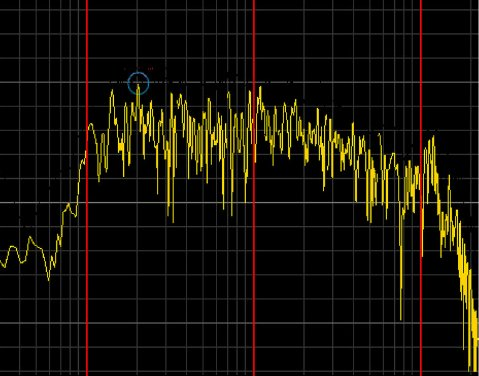

# PrisonBreak own solution
 
## World genaration
World is being genarated with different techniques:
    
    1. Random based.
    2. Perlin based.
    3. Image based.
      1. The Image based generation is used for making the have his own shape and not be based on the standard unity terrain. 
> point displacement is going to be added in a future commit.

### SplatMapping
Splatmapping is used for painting the terrain a certain texture.
The texture is applied based on height and slope. The reason why is chose splatmapping / texture splatting is. It is from what I read one of the most effective ways of applying textures to terrain rendering and saves a lot of memory usage.

The basics are as followed: SplatMapping is a way of making  

for more detail information visit the [wiki](https://en.wikipedia.org/wiki/Texture_splatting)
and also [this](http://www.gamasutra.com/blogs/AndreyMishkinis/20130716/196339/Advanced_Terrain_Texture_Splatting.php) link for the basics understanding in Unity3D.There is one problem the prevouis link is HLSL based scripting so you can't littarly copy paste the code but it is a good insperation source.

For example this piece of code

```c#
float3 blend(float4 texture1, float a1, float4 texture2, float a2)
{
    return texture1.rgb * a1 + texture2.rgb * a2;
}
```

### Noise Genaration
The different type of noise. Are used for creating different propeties of the terrain.

#### High frequency noise
High frequency noise is for adding fine detail to the terrain and is used make the terrain a little bit on even for a more realistisch feel of the terrain.You can in the image below that it is not smart to use it for the main generation pass.


#### Low frequency noise
Low frequency noise is being used for taking care of the main genaration pass. For example the hight diferences.


#### Random based noise
This type of "noise" is used by me for making the terrain in it whole al little bit more bumpy and on even. I found while making the script in class that it could use a bit more randomnis to the terrain.

## Item

## Inventory
