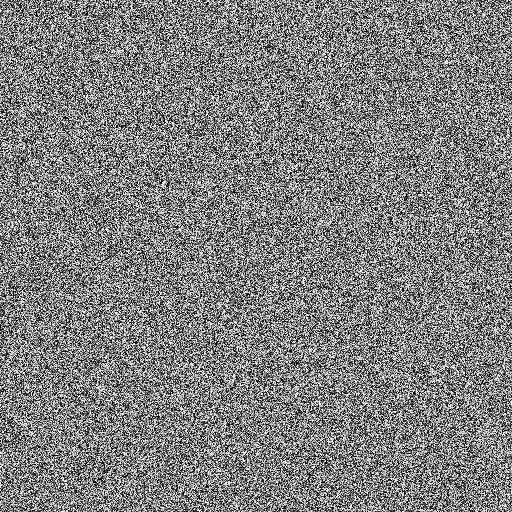

# PrisonBreak own solution

# Depencies
* [simpleJSON](http://wiki.unity3d.com/index.php/SimpleJSON)
* Unity3D 2018.3 or newer
    * [Macosx download link](https://store.unity.com/download/thank-you?thank-you=personal&os=osx&nid=1370)
    * [Windows download link](https://store.unity.com/download/thank-you?thank-you=personal&os=win&nid=1370)
    * [Linux download link](https://forum.unity.com/threads/unity-on-linux-release-notes-and-known-issues.350256/page-2)
****
## World genaration
World is being genarated with different techniques:
    
    1. Random based.
    2. Perlin based.
    3. Image based.
      1. The Image based generation is used for making the have his own shape and not be based on the standard unity terrain. 
> point displacement is going to be added in a future commit.

### SplatMapping
Splatmapping is used for painting the terrain a certain texture.
The texture is applied based on height and slope. The reason why is chose splatmapping / texture splatting is. It is from what I read one of the most effective ways of applying textures to terrain rendering and saves a lot of memory usage.

The basics are as followed: SplatMapping is a way of changing the alpha valau's of a texutere and because all of the textures are stacked on top of each other it wil transition to the next texture.In the end it combines all the textures and applies 1 texture to the terrain.

for more detail information visit the [wiki](https://en.wikipedia.org/wiki/Texture_splatting)
and also [this](http://www.gamasutra.com/blogs/AndreyMishkinis/20130716/196339/Advanced_Terrain_Texture_Splatting.php) link for the basics understanding in Unity3D.There is one problem the prevouis link is HLSL based scripting so you can't littarly copy paste the code but it is a good insperation source.

For example this piece of code.

```c#
float3 blend(float4 texture1, float a1, float4 texture2, float a2)
{
    return texture1.rgb * a1 + texture2.rgb * a2;
}
```

### Noise Genaration
The different type of noise. Are used for creating different propeties of the terrain.

### Perlin Noise
The noise generating part of the project is based on perlin noise.The main difference between perlin noise and random based noise is as follows. Random based noise has a value of 0 or 1 there is no in between. Perlin based noise on the other hand has a valau from 0 to 1. So it also 0.5 and 0.3 so on and so on.

<p align="left">
    
    
</p>

When using Perlin noise in unity3D you need to assign a x and y cordinates to the perlin noise.
These x and y cordinates are used to pick a place in the perlin noise range of numbers. After that you can use it for different use cases.

Mathf.PerlinNoise returns a float. A int should only be used if you need whole numebers otherwise you should use float that gives more flexibility.

```c#
float noise = Mathf.PerlinNoise(xcord,ycord);
```

#### High frequency noise 

High frequency noise is for adding fine detail to the terrain and is used make the terrain a little bit on even for a more realistisch feel of the terrain.You can in the image below that it is not smart to use it for the main generation pass.


#### Low frequency noise
Low frequency noise is being used for taking care of the main genaration pass. For example the hight diferences.


****

### Random based noise
This type of "noise" is used by me for making the terrain in it whole al little bit more bumpy and on even. I found while making the script in class that it could use a bit more randomnis to the terrain.Random based noise is very useful if you want to add a more detail to for example above a certain height line.
    
> Random.Valua returns a random number with the max limit being int.Max
```c#
int a = Random.Valua;
```

## Item
The Items are based on a abstract class called [item](google.com).

## Inventory
